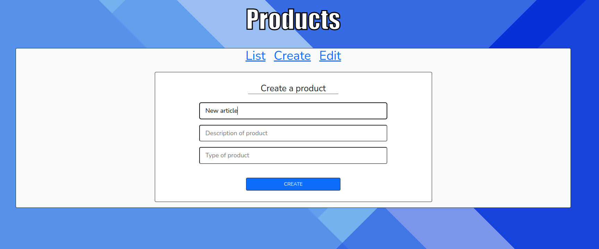

# <h1 style='text-align: center; color: #F72C1F;'>CRUD with Laravel || Vuejs</h1>

### This application is a simple crud with the classics operations like create, read, update and delete. This project was made using laravel and vuejs.

---------

# Technologies


------------------

# Objective

### The objective of this project is simplely practice the new changes that has laravel 9 and do som kind of demostration to all these features and keep going improving in future versions.

-------

# Requirmentes

+ php 8.1

+ Nodejs 16

+ Laravel 9

+ Vuejs 3

+ MYSQL previously installed

+ Bootstrap

-------
# Run this App and setup
+ Clone the repository
```
git clone https://github.com/userlg/Crud-Laravel-9-and-Vuejs)
```
+ Edit and create the .env files with the your database credentials

+ Install all dependecies. Execute the following commands inside the project folder
```
composer install
```
```
npm install
```
+ Run this project use the following commands
```
php artisan serve
```
```
npm run watch
```
+ Type in the navigation bar of you web browser
```
localhost:8000
```
+ And if you did all steps correctly then you are reade to rock !!
--------
# Screenshots




_______
# Create by userlg --> <a href='https://github.com/userlg'>Github Profile</a>